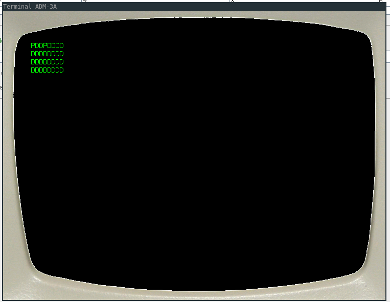

# umcs-cellular-forest
Burning forest cellular automaton - Intel 8080 Assembly  

The code is not functional and doesn't work beacause of the general idea of implementing this in assembly which was stupid, so additional debugging is required for this project to work properly.
Still, a low level solution is more interesting that one in any high level language!
  
EmuStudio recommended for cpu emulation.

